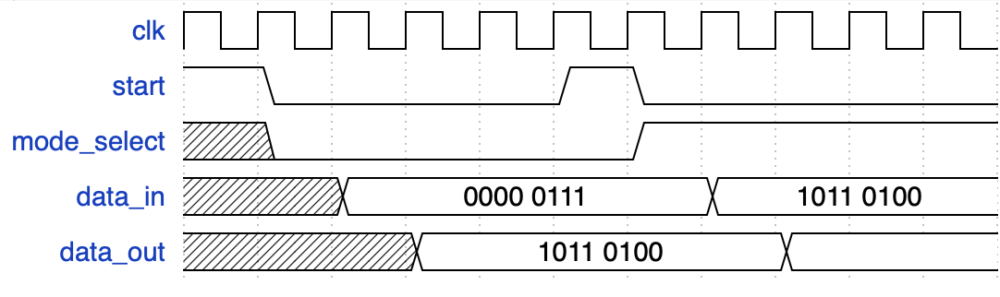

# Design Specification and Function Description
#### Hamming Code Encoder/Decoder for Single-Bit Error Correction and Double-Bit Error Detection

## Description
The project aims to design a digital circuit block that implements the Hamming code. It will consist of an encoder that encodes 4-bit data inputs into 8-bit code-words, and a decoder that will receive 8-bit codewords to detect and correct single-bit errors. It will also be able to detect 2-bit errors.

This module is implemented as a FSM (finite-state machine). On each rising clock edge it progresses through the 5 states as follows:

1. **IDLE**
 - wait for the **start** signal (`ui_in[0] = 1`).  

2. **IN1**
 - sample **mode_select** (`ui_in[0]`) to choose either `encode (0)` or `decode (1)` mode

3. **IN2**  
  - Encode mode: capture 4-bit **data_in** from `ui_in[3:0]`.  
  - Decode mode: capture 8-bit **code_in** from `ui_in[7:0]`.  

4. **OUT1**
  - drive 8-bit **code_out** (encoded or corrected) to `uo_out[7:0]`.  
5. **OUT2**: 
  - Encode mode: continue outputing encoded codeword
  - Decode mode: drive 5-bit status (error_location, error_flag) to `uo_out[4:0]`.

After OUT2, the FSM returns to IDLE.

## Input/Output
| Direction               | State | Mode | Pin          | Width | Description                                           |
|-------------------------|:-----:|:----:|:------------:|:-----:|:------------------------------------------------------|
| **Input** ui_in[7:0]    | IDLE  |  –   | ui_in[0]     | 1     | start                                                 |
|                         | IN1   |  –   | ui_in[0]     | 1     | mode_select: 0 = encode, 1 = decode                   |
|                         | IN2   |  0   | ui_in[3:0]   | 4     | data_in: 4-bit dataword                               |
|                         |       |  1   | ui_in[7:0]   | 8     | code_in: 8-bit codeword                               |
| **Output** uo_out[7:0]  | OUT1  |  0   | uo_out[7:0]  | 8     | code_out: 8-bit codeword                              |
|                         |       |  1   | uo_out[7:0]  | 8     | code_out: corrected codeword                          |
|                         | OUT2  |  0   | uo_out[7:0]  | 8     | code_out                                              |
|                         |       |  1   | uo_out[1:0]  | 2     | error_flags: 00 = error free, 01 = 1-bit error, 10 = 2-bit error |
|                         |       |      | uo_out[4:2]  | 3     | error_location (of 1-bit error)                       |

### Input/Output Format

~~~
D - dataword
C - checkbit
L - error_location
F - error_flag
~~~
**Encoder:** 
- Input { -, -, -, -, D3, D2, D1, D0, }
- output { Call, D3, D2, D1, C2, D0, C1, C0 }

**Decoder**
- Input { Call, D3, D2, D1, C2, D0, C1, C0 }
- output1 { Call, D3, D2, D1, C2, D0, C1, C0 }  (corrected)
- output2 { -, -, -, L2, L1, L0, F1, F0 }

| Error_flag |  Description                                       |
|------------|----------------------------------------------------|
| `00`       | No error; position – don’t care                    |
| `01`       | 1 error – **error_position** will be 0 ≤ x < 8       |
| `10`       | 2-bit error detected; error position – don’t care  |
| `11`       | N/A – will not happen                              |

### PARITY / SYNDROME CALCULATION
**Parity Bits**:   
  - C0 = D0 ⊕ D1 ⊕ D3  
  - C1 = D0 ⊕ D2 ⊕ D3  
  - C2 = D1 ⊕ D2 ⊕ D3  
  - Call = D0 ⊕ D1 ⊕ D2 ⊕ D3 ⊕ C0 ⊕ C1 ⊕ C2  

**Syndrome**:  
  - decoder recompute the parity bits (ie. R0-R2, Rall)  
  - The 3-bit syndrome is computed by comparing the inputted parity bits and the newly computed ones: 
    - S = [C2⊕R2, C1⊕R1, C0⊕R0]

## Block Diagram

## Timing Diagram

<!--  -->

## Test Plan
#### Test 1 - Check encoding logic
  - define a lookup table containing data inputs with the corresponding outputs expected
  - loop through known 4-bit inputs, verify output matches expected 8-bit
#### Test 2 - Decode known 8-bit inputs
  - Verify output matches expected 4-bit
  - Define lookup table containing inputs with corresponding outputs
#### Test 3 - Introduce single-bit errors in 8-bit codeword
  - Verify error has been detected
  - Verify error bit location is correct
  - Verify that the final result has been corrected
#### Test 4 - double error detection
  - Introduce double-bit errors in 8-bit, decode, and verify errors have been detected

#### Test Results

## Logs

#### Teanwork / Division of Responsibilities

We held regular meetings to discuss design choices, debug issues, and review each other's code. Both partners contributed to testing and documentation, ensuring a robust and well-documented final project.

- **Helena:**  
  - Drafted and implemented the encoder and decoder logic modules
  - Developed and improved the testbench and test cases
  - Contributed to documentation and timing diagrams

- **Cynthia:**  
  - Designed and implemented the FSM and state transitions in the top-level module
  - Led debugging and integration efforts to ensure the project runs correctly and produces valid outputs
  - Contributed to documentation and block diagrams

  The project was highly collaborative, with both partners contributing to all major components. While Helena primarily drafted and implemented the encoder and decoder logic modules, and Cynthia focused on designing the FSM and state transitions in the top-level module (`project.v`), both partners participated in writing and improving the testbench and test cases, as well as documentation and diagrams. Most test cases were written by Helena, with Cynthia contributing to the remainder. Debugging and integration were joint efforts, with regular reviews and shared problem-solving throughout the project.

### Timeline

| Date      | Activity & Contributor(s)                                                                   |
|-----------|---------------------------------------------------------------------------------------------|
| May 26-June 6 | Cynthia & Helena: Discussed and drafted project specifications                          |
| June 7-20 | Helena & Cynthia: updated specifications and added initial diagrams                         |
| June 23-24| Helena: Implemented initial encoder and decoder modules                                     |
| June 24   | Cynthia: Drafted FSM design and state transitions & wrote informal test for encoder         |
| June 27   | Cynthia: Transferred initial documentation/resources to markdown format                     |
| July 7    | Helena: added test cases for encoder and decoder (no error)                                 |
| July 8    | Cynthia: Debugged decoder logic, ran tests for single/double error cases                    |
| July 13   | Cynthia: Revised block diagram and updated documentation                                    |
| July 15   | Helena: Improved testbench coverage, added edge case tests                                  |
| July 18   | Helena & Cynthia: Joint debugging session - discussed output timing and register update issues |
| July 21   | Helena: Finalized all test cases                                                            |
| July 27-28| Cynthia: Attempted OpenSTA timing analysis                                                  |
| July 29 | Helena & Cynthia: Documentation review + final submission |

#### Problems Encountered & Solutions

- **FSM Output Timing:**  
  Output signals were not updating as expected. After reviewing the sequential logic and examining internal signals within each state, we realized outputs are only valid after state transitions and clock edges. We added extra clock cycles in the testbench to ensure correct sampling.

- **Decoder Syndrome Calculation:**  
  Initial syndrome logic did not correctly identify error locations for certain bit flips. Cynthia traced the issue to parity bit mapping and corrected the assignment logic.

- **Testbench Synchronization:**  
  Both partners worked together to align the testbench with the FSM timing, ensuring inputs and outputs were sampled in the correct states.

- **Improper Clearing of Input Registers:**
  Outputs would occasionally be inconsistent from the expected values, and no matter the input, would always display the value 0b101. Helena traced the issue to lack of reset of input registers between cycles, which caused the IDLE state to be interrupted earlier than intended. This issue was resolved by forcing a reset between each test run.